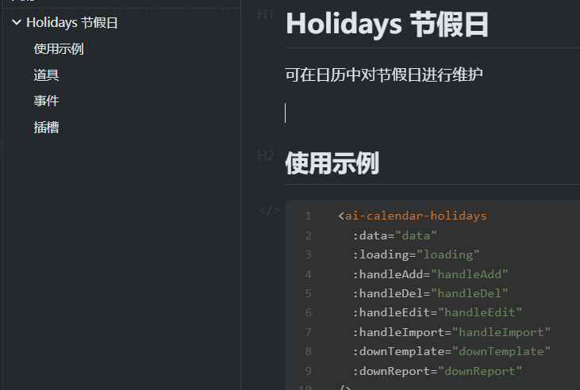

# Holidays 节假日

可在日历中对节假日进行维护



## 使用示例

```html
<ai-calendar-holidays
  :data="data"
  :loading="loading"
  :handleAdd="handleAdd"
  :handleDel="handleDel"
  :handleEdit="handleEdit"
  :handleImport="handleImport"
  :downTemplate="downTemplate"
  :downReport="downReport"
/>
```

## 道具

| 参数         | 类型     | 必填 | 说明                                                                                                                                                                                                                                                                                | 默认值           |
| ------------ | -------- | ---- | ----------------------------------------------------------------------------------------------------------------------------------------------------------------------------------------------------------------------------------------------------------------------------------- | ---------------- |
| data         | Object   |      | 节假日数据 以每一天的日期作为属性名，属性值为数组（可能包含多个节日）例：{"2023-04-07": [{//节日名称 name: "国庆节", // 是否为节日开始日期 isStartDay: true, //节日开始日期 startDate: "2023-04-07", //节日结束日期 endDate: "2023-04-08",},], "2023-04-08": [{name: "国庆节" },],} |                  |
| loading      | Boolean  |      | 加载中                                                                                                                                                                                                                                                                              | false            |
| handleAdd    | Function |      | 处理新增的异步函数                                                                                                                                                                                                                                                                  | function(model)  |
| handleDel    | Function |      | 处理删除的异步函数                                                                                                                                                                                                                                                                  | function(record) |
| handleEdit   | Function |      | 处理编辑的异步函数                                                                                                                                                                                                                                                                  | function(model)  |
| handleImport | Function |      | 用于处理导入的异步函数,传入的参数为选中的文件,需返回导入的结果，返回结果后取消 loding 结果示例：{status: "success", fail: "2", total: "3",hasFailReport:true} status 状态 fail 错误的数据数量 total 总数 hasfailReport 是否含有错误报告                                             | function(file)   |
| downTemplate | Function |      | 用于处理下载模板的异步函数 返回结果后取消 loding                                                                                                                                                                                                                                    | function()       |
| downReport   | Function |      | 用于处理下载错误报告的异步函数 返回结果后取消 loding                                                                                                                                                                                                                                | function()       |
|              |          |      |                                                                                                                                                                                                                                                                                     |                  |
|              |          |      |                                                                                                                                                                                                                                                                                     |                  |
|              |          |      |                                                                                                                                                                                                                                                                                     |                  |
|              |          |      |                                                                                                                                                                                                                                                                                     |                  |

## 事件

| 名称        | 说明               | 回调参数            |
| ----------- | ------------------ | ------------------- |
| panelChange | 滚动到底部触发事件 | function(date,mode) |

## 插槽

| name | 说明 |
| ---- | ---- |
|      |      |
